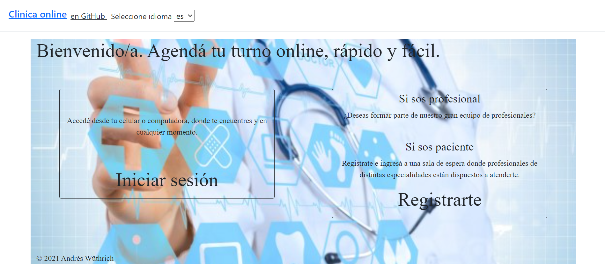
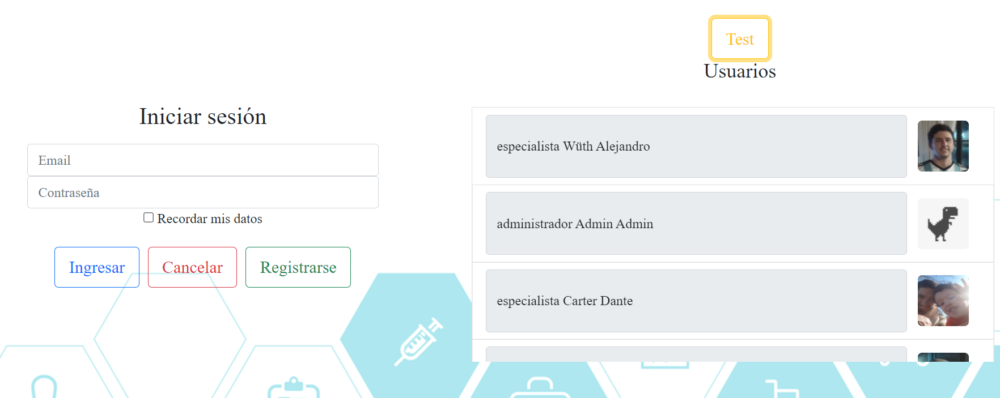
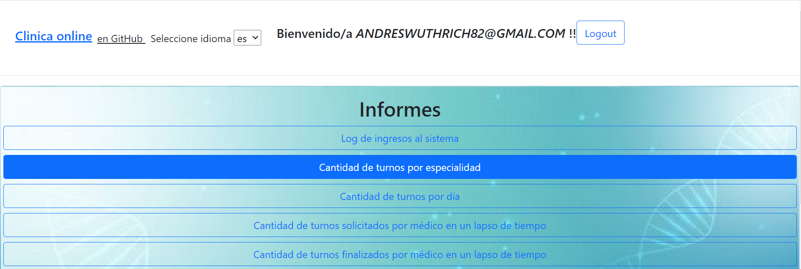
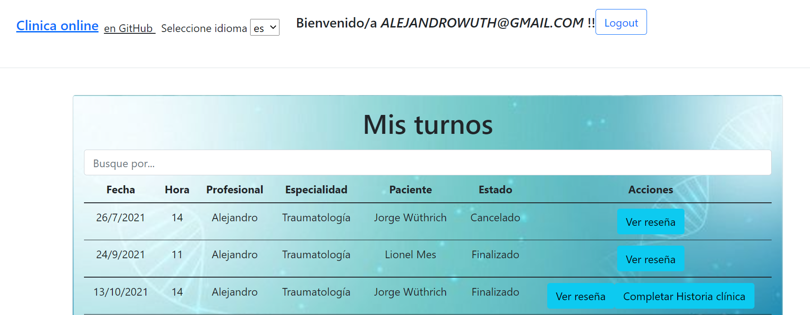
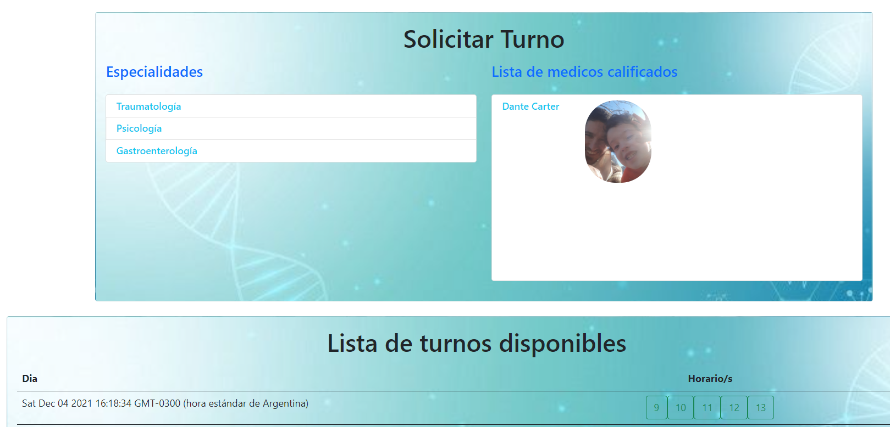

# ClinicaOnline {:height="50%" width="50%"}

Proyecto realizado con [Angular CLI](https://github.com/angular/angular-cli) version 12.0.0.
TP Final Laboratorio IV 2021 - UTNFRA - Técnico superior en programación.
[Sitio WEB de GitHub](https://github.com/AndresWuthrich/clinicaonlineadw)

-----
## Ingreso a la Web 

**Bienvenida**

La clínica OnLine, especialista en salud, cuenta actualmente con consultorios (6 en la actualidad), dos laboratorios (físicos en la clínica), y una sala de espera general. Está abierta al público de lunes a viernes en el horario de 8:00 a 19:00, y los sábados en el horario de 8:00 a 14:00. Trabajan en ella profesionales de diversas especialidades, que ocupan los consultorios acorde a su disponibilidad, y reciben en ellos pacientes con turno para consulta o tratamiento. Dichos turnos son pedidos por la web seleccionando el profesional o la especialidad.

>Desde la pantalla de bienvenida podrás:
* Seleccionar idioma de la web. Opciones: Español - Inglés - Portugués.
* Ingresar a las siguientes opciones:
    * Registro
    Primero deberá seleccionar perfil. Luego completar datos requeridos, y validar mail.    
    
    * Login
    Con usuario validado podrá acceder a la web. Los especialistas deberán ser aprobados por el administrador.
    

<!--  -->
-----
## Perfiles 
>Se permiten los sig. perfiles en la web:
* Administrador
* Especialista
* Paciente

## Funcionalidades 
>Todos los usuarios podrán ver su perfil.

* Administrador:
    
    * Solicitar Turno.
    * Administrar usuarios especialistas.
    * Ver/ cancelar turnos.
    * Informes:
        * Log de ingresos al sistema
        * Cantidad de turnos por especialidad
        * Cantidad de turnos por día
        * Cantidad de turnos solicitado por médico en un lapso de tiempo
        * Cantidad de turnos finalizados por médico en un lapso de tiempo      

* Especialista:
    
    * Ver/Aceptar/Rechazar/Cancelar turnos asignados.
    * Cargar historia clínica de turnos realizados.

* Paciente:
    
    * Solicitar Turno
    * Ver/Cancelar turnos solicitados.
    * Calificar atención.
    * Completar encuesta.
    * Ver historia clínica. 
